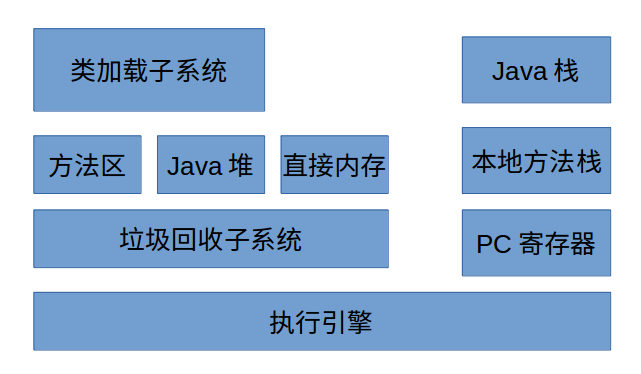

# 《实战Java虚拟机》读书笔记

本文为对《实战Java虚拟机》的心得总结，欢迎大家批评指正。

------

## 第二章 虚拟机的基本结构


### Java虚拟机的基本组成

```

```

 

------

- **类加载子系统** 

类加载子系统负责从文件系统或者网络中加载Class信息，加载的信息存放在***方法区***的内存空间，方法的实例存放在***Java堆***当中。

- **方法区** 

存放类加载子系统加载的方法，和运行时的常量池信息，包括字符串字面量和数字常量。

- **Java堆**

几乎所有的Java对象的实例都存在放Java堆当中，由所有线程共享。

- **直接内存**

Java的NIO库允许Java程序直接使用内存，速度比Java堆快。

- **垃圾回收系统**

垃圾回收系统可以对***方法区，Java堆，直接内存***进行回收。

- **Java栈**

每一个Java线程都有一个Java栈，在线程创建时被创建。Java栈当中保存着栈帧信息。Java栈与方法的调用、返回密切相关。

- **本地方法栈**

本地方法栈与Java栈类似，不过Java栈完成的是Java方法的调用，而本地方法栈负责本地方法的调用、返回（通常由C语言编写）作为Java虚拟机的重要扩展。

- **程序计数器PC**

每一个Java线程都有一个PC寄存器，每一个Java线程总是在执行一个方法，如果当前的方法是Java方法，那么PC寄存器的内容为方法对应的指令，如果是本地方法，那么是undefined.

------

### Java堆初探

一百来说，不同的垃圾回收机制下，Java堆的结构不尽相同，一种常见的结构是将整个Java堆分成***新生代，老年代***两种，新生代用于存放新生对象或者年龄不大的对象，分为***eden区，s0区，s1区*** ，s0区s1区有时也被称为from区，to区。