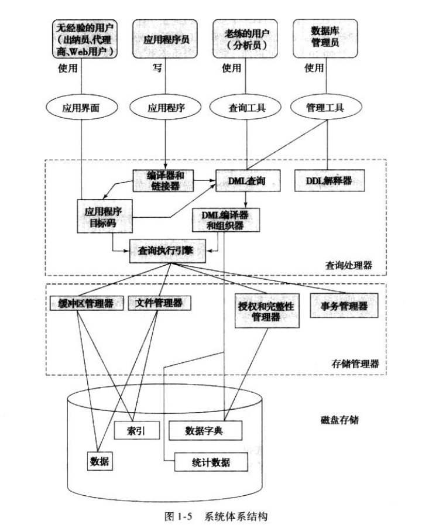

本文是对该书的一个精炼和总结，如有错误烦请批评指正。

# 第一章 引言

**1.数据库管理系统（DBMS)**  由一个相互关联的数据的集合和一组用于访问这些数据的程序组成。数据的集合常被称作为**数据库** 。

**2.数据抽象的级别**

- 物理层： 最低层次的抽象，描述数据是怎样存储的，实现复杂的数据结构
- 逻辑层： 描述数据库中存储什么数据，以及这些数据之间的关系
- 视图层： 最高层次的抽象，只描述用户需要的数据库的某个部分

**3.实例与模式**

- 模式： 描述数据库的总体设计
- 实例： 描述在当前模式下，数据库的一个实体（信息的集合）

**4.数据模型**：  一个描述数据，数据联系，数据语义以及一致性约束的概念工具的集合。数据模型提供了一种*描述物理，逻辑，视图层数据库设计的方式*。

几种常见的数据模型

- 关系模型： 用表的集合来表示数据以及数据之间的联系，是一种最常用的数据模型。
- 实体-联系模型（E-R）模型： 现实世界中由一组实体和之间的联系构成
- 基于对象的数据模型： 可以看作是一种E-R模型增加了封装、方法和对象标识。

------

## 一、数据库语言

数据库语言由**数据库定义语言**和**数据库操纵语言**构成。

### 数据库操纵语言（DML）

**对实例进行操作。**使得用户可以访问满足特定的规则的数据的语言。如对存储在数据库中的信息进行检索，插入、删除、修改数据。

### 数据库定义语言（DDL）

**对模式进行操作。**定义数据库模式的实现细节。DDL中提供了指定**一致性约束**的工具。

DDL以指令作为输入，输出放在**数据字典**中，数据字典中包含**元数据**（数据的数据）。

------
<!--more-->
## 二、数据库设计

- 数据库设计的初始阶段：全面刻画预期的数据库用户的数据需求。
- 概念设计阶段： 设计者根据上述需求，选择一个**数据模型**，根据这个数据模型，将需求转换成数据库的**概念模式**。这一阶段的重点是**描述数据以及之间的联系**，而不是指定存储细节。例如决定数据中有那些属性等。
- 逻辑设计阶段： 将高层的概念模式映射到要使用的数据模型上
- 物理设计阶段： 制定数据库的物理特性，包括文件组织形式以及内部的存储结构。

------

## 三、数据存储与查询

数据库系统可以大致分为**存储管理器**和**查询管理器**

### 存储管理器

存储管理器负责数据库中数据的存储、检索和更新。是数据库中存储的底层数据与应用程序以及用户提交的查询之间的接口。

- 权限及完整性管理器： 检测是否满足完整性约束，并检查用户的访问权限
- 事务管理器： 保证即使发生了故障，数据库也保持在正确的状态。并且保证并发事务的执行不发生冲突。
- 文件管理器： 管理磁盘存储空间的分配，管理用于表示磁盘上所存储的信息的数据结构。
- 缓冲区管理器： 负责将数据从磁盘读取到内存当中来，并决定哪些数据应被缓冲读取。

#### 存储管理器实现的数据结构

- 数据文件： 存储数据库自身
- 数据字典： 存储关于数据库结构的**元数据**，尤其是数据库模式。
- 索引： 提供对数据的快速访问，数据库的索引提供了指向特定数据的指针。

------

### 查询处理器

- DDL解释器： 解释DDL语言并将这些定义记录在数据字典中。
- DML编译器： 将查询语言中的DML语句翻译成一个执行方案

------

## 四、事务管理

## 五、数据库体系结构

今天数据库系统大多是客户机——服务器模型。

